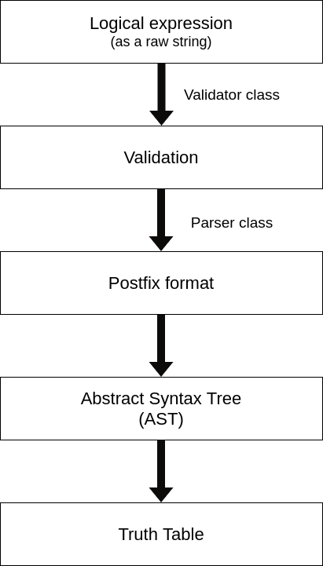
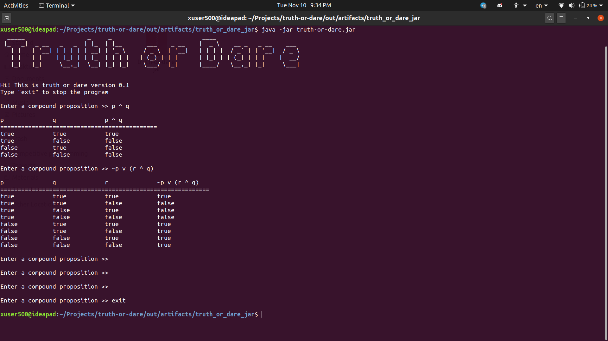

# Truth or Dare

### Description
"Truth or dare" is a project that I built from scratch using Java for my discrete mathematics class. It is basically a minimalistic truth table generator where the user is prompted at first to input a logical function (compound proposition). After that, the program starts to validate and parse the expression provided by the user before converting it into a [postfix](https://en.wikipedia.org/wiki/Reverse_Polish_notation) format. The next step is to construct an [abstract syntax tree](https://en.wikipedia.org/wiki/Abstract_syntax_tree) which is very useful for evaluating and modifying several kinds of mathematical and logical expressions. Abstract syntax trees are also employed by compilers during the compilation step of programming languages.

### Project Screenshot

### Instructions

- To execute the program: run the Bin class using your favorite IDE
- To run the project as a jar: download the jar file from this project's release files, then execute it using the following bash command `java -jar truth-or-dare.jar`

### Dependencies

- Jfiglet: the famous figlet script re-written in java

Please refer to the pom.xml file for more info

